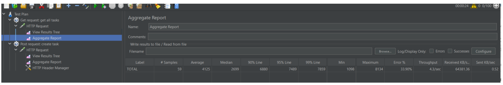
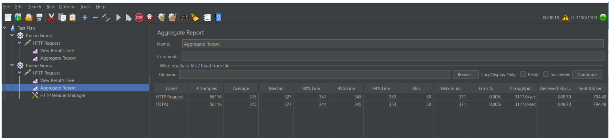

# Отчет по Нагрузочному Тестированию API (Spring Boot Task Service)

**Тестируемый сервис:** Spring Boot Task API (Локально, in-memory)
**Цель тестирования:** Оценить устойчивость, время отклика и выявить узкие места при одновременной работе 20 пользователей, имитируя типичные операции CRUD.

## 1. Настройка Тестирования

Тестирование проводилось локально с использованием JMeter. Для имитации реальных операций были настроены 2 типа запросов: чтение списка (GET) и создание новой сущности (POST).

### Конфигурация JMeter

| Параметр | Значение                                                       |
| :--- |:---------------------------------------------------------------|
| **JMeter Версия** | 5.6.2                                                          |
| **Тестируемый URL** | `http://localhost:8080`                                        |
| **Общее число пользователей (Потоков)** | 1000 (POST) и 100 (GET)                                        |
| **Время нарастания нагрузки (Ramp-up)** | 0 секунд                                                       |
| **Общее число итераций** | бесконечно для проверки максимально удерживаемой нагрузки      |
| **Валидация** | Проверка HTTP статуса (200/201) и наличия ключевых полей JSON. |

## 2. Анализ Производительности

### Устойчивость Сервиса

Сервис продемонстрировал **высокую устойчивость** под данной нагрузкой (1000 одновременных пользователей) на создание новых задач.
*   **Процент ошибок:** 0.00% для GET запросов, что подтверждает корректную работу валидации и отсутствие проблем с конкурентным доступом к структурам данных (в данном случае, `List` в памяти).
    
Сервис продемонстрировал **низкую устойчивость** под данной нагрузкой (100 одновременных пользователей) на чтение списка задач.
*   **Процент ошибок:** 33.90% для POST запросов, что подтверждает наличие проблем с конкурентным доступом к структурам данных (в данном случае, `List` в памяти).

### Метрики Ключевых Эндпоинтов

1.  **Операции Чтения (GET):**

2.  **Операции Записи (POST):**

## 3. Выводы и Рекомендации по Оптимизации

### Выводы

Сервис в методе GET api/tasks (чтение списка задач), использующий структуры данных в оперативной памяти, **плохо справляется с нагрузкой в 100 одновременных пользователей**. Пропускная способность около 4.3 запросов в секунду.

Сервис в методе POST api/tasks (создание задачи), использующий структуры данных в оперативной памяти, **отлично справляется с нагрузкой в 1000 одновременных пользователей**. Пропускная способность около 3117 запросов в секунду.

### Предпосылки для Дальнейшей Оптимизации (При Переходе на Продакшн)

Поскольку данное тестирование проводилось на in-memory структуре, выявленные метрики являются идеальными. Однако, если бы этот сервис был развернут с реальной базой данных (например, PostgreSQL), следующие шаги были бы критичны:

1.  **Тестирование с БД:** Необходимо повторить тест, используя JPA/Hibernate, чтобы проверить производительность реальных SQL-запросов и эффективность пула соединений (например, HikariCP).
2.  **Кеширование:** Для эндпоинта `GET /api/tasks` (который читает статический список) необходимо внедрить кеширование (например, с использованием `@Cacheable` Spring Boot), чтобы свести время отклика к минимуму.
3.  **Асинхронность:** Если бы операция POST включала долгие внешние вызовы, следовало бы рассмотреть использование `@Async` или реактивных фреймворков (WebFlux) для предотвращения блокировки потоков Tomcat.
4.  **Пагинация:** Для снижения нагрузки на сервер необходимо внедрить пагинацию данных при чтении списка задач.

---
**JMeter Файл (`Yagunov_Denis_lab3_report.jmx`):** Сценарий теста приложен отдельно в соответствии с требованием задания.
